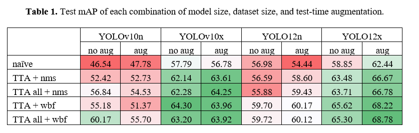

# IEEE ICIP 2025: CADOT Challenge

#### By [Yi Jie WONG](https://yjwong1999.github.io/) & [Jing Jie TAN](https://jingjietan.com/) et al

## TLDR
🤩 Our approach is simple, scale everything! We proposed a systematic `Tri-Axial Scaling` to approach Aerial Object Detection via:
1. Model Size
2. Dataset Size & Quality
3. Test-Time Inference

Basically, we achieve this `Tri-Axial Scaling` by:
1. Scaling model size
2. Diffusion Augmentation & Balanced Data Sampling
3. Test-Time Inference = Test-Time Augmentation + Ensemble Models

Basically, we notice that:
1. A larger model can learn more effectively from a noisy and imbalanced dataset compared to a smaller model.
2. A larger model benefits more from dataset size scaling.
3. A smaller model can also achieve performance comparable to a larger model through balanced data sampling.
4. A larger model tends to overfit when using a balanced data sampling strategy, but this can be mitigated by increasing the amount of data (hence, data scaling).

 </br>
⬆️ Scaling Model Size vs Scaling Data Size vs Scaling Test-Time Inference

## Step 1: Setup Repo

[](https://colab.research.google.com/drive/198dwtjhB3ETFRHRPLWNCi_bAr1g5213i?usp=sharing) 

👆 Please refer our Colab link to try out our code seamlessly! You might need `Colab Pro` to train the larger YOLO variants.

Conda environment
```bash
conda create --name yolo python=3.10.12 -y
conda activate yolo
```

Clone this repo
```bash
# clone this repo
git clone https://github.com/yjwong1999/Double_J_CADOT_Challenge.git
cd Double_J_CADOT_Challenge
```

Install dependencies
```bash
# Please adjust the torch version accordingly depending on your OS
pip install torch==2.2.1 torchvision==0.17.1 torchaudio==2.2.1 --index-url https://download.pytorch.org/whl/cu121

# Install Jupyter Notebook
pip install jupyter notebook==7.1.0

# install this version of ultralytics (for its dependencies)
pip install ultralytics==8.3.111

# uninstall default ultralytics and install my ultralytics that support Timm pretrained models
pip uninstall ultralytics -y
pip install git+https://github.com/DoubleY-BEGC2024/ultralytics-timm.git

# install this to use wighted box fusion
pip install ensemble-boxes

# Remaining dependencies
pip install pycocotools
pip install requests==2.32.3
pip install click==8.1.7
```

## Step 2: Setup Dataset
```bash
# to convert the CADOT dataset from the default COCO format to YOLO annotation form
python setup_data.py
```

## Step 3 (Shortcut): Download Our Trained Models

🚅 To avoid training all our models which are time-consuming, you can download our trained models using the provided bash script. 

Alternatively, you can manually search our models from [dropbox](https://www.dropbox.com/scl/fo/ftpub1vybquydapvhhfvw/APMPvKHcA-912DWvfR7f0XQ?rlkey=dn9vio38yni2ic3jmw7u2dss9&st=evkv5k0h&dl=0) (in case the .sh file is not working in Windows machine).

```bash
bash download_our_model.sh
```

## Step 3: Training (Hyperparameters discussion)

⚠️ If you had downloaded our trained models from previous steps, please skip this step. Else you will have repeated models.

❗Note that due to time constraints, we did not train all possible experiments. Hence, in general, our hyperparameters are chosen based on:
- If trained via balanced sampling, batch size = 8, image size = 960, epochs = `100 for smallest YOLO12n, 50 for YOLO12s, 30 for YOLO12x`
- If trained without balanced sampling, batch size = 16, image size = 640, epochs = 100

Actually, we should set all image sizes to 960, but we only considered this step at a later stage. Meanwhile, setting a higher image size increases GPU memory requirements, so we have to lower the batch size. As for epochs, we set them all to 100 for training without balanced sampling. If trained with balanced sampling, we found that larger models tend to overfit, so we have to reduce the number of epochs.

### Training Part 1 (without synthetic data)
  
```bash
# train ResNext101-YOLO12 naively without tricks
python3 train.py --model-name "../cfg/yolo12-resnext101-timm.yaml" --epoch 100 --batch 16 --imgsz 640

# train yolo12n using balanced sampling
python3 train_balanced.py --model-name "yolo12n.pt" --epoch 100 --batch 8 --imgsz 960

# train yolo12s using balanced sampling
python3 train_balanced.py --model-name "yolo12s.pt" --epoch 50 --batch 8 --imgsz 960
```

### Training Part 2 (with synthetic data)
```bash
# setup our synthetic dataset
python setup_synthetic_data.py

# train yolo12x with synthetic data only
python3 train_balanced.py --model-name "yolo12x.pt" --epoch 100 --batch 16 --imgsz 640

# train yolo12x using balanced sampling and synthetic data
python3 train_balanced.py --model-name "yolo12x.pt" --epoch 100 --batch 8 --imgsz 960
```

### Move the trained models into `Double_J_CADOT_Challenge/models` directory
```bash
python3 move_models.py
```

## Step 4: Inference
```bash
# Run the inference code
python3 infer.py --tta all
```
❗Note that:
- Even when using the exact same dependencies (torch/numpy/ultralytics/etc), you might not obtain the same results.
- This is because `different machines`, `different CUDA`, `different random seed` can also contribute to variations in results.
- For instance, we tested training the exact `same model` and `same hyperparameter configurations` using the `same A100 GPU`, but on `Google Colab` and `Lightning AI`.
- However, the `performance discrepancies` between the two models trained on `different platforms` were noticeable.
- Hence, you might not be able to reproduce the exact same results.
- Nevertheless, we believe our results on `tri-axial scaling` are valuable to the community 🤗
