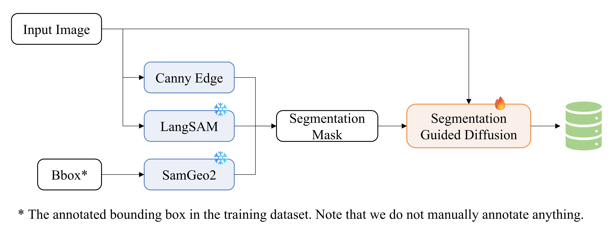
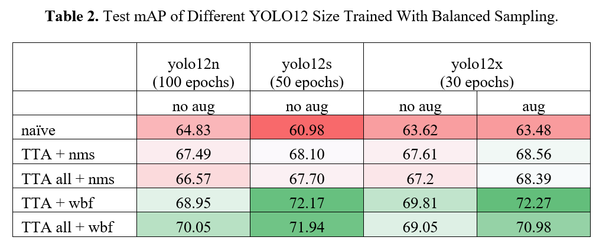
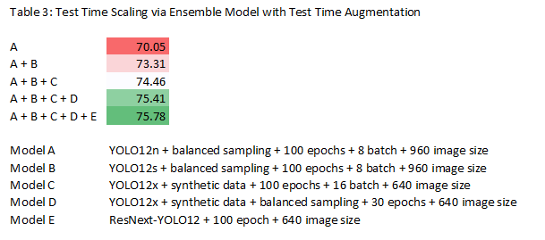

## TLDR

❗Full Report Coming Soon!

🤩 Our approach is simple, scale everything! We proposed a systematic `Tri-Axial Scaling` to approach Aerial Object Detection via:
1. Model Size
2. Dataset Size & Quality
3. Test-Time Inference

Basically, we achieve this `Tri-Axial Scaling` by:
1. Scaling model size
2. Diffusion Augmentation & Balanced Data Sampling
3. Test-Time Inference = Test-Time Augmentation + Ensemble Models

Basically, we notice that:
1. A larger model can learn more effectively from a noisy and imbalanced dataset compared to a smaller model.
2. A larger model benefits more from dataset size scaling.
3. A smaller model can also achieve performance comparable to a larger model through balanced data sampling.
4. A larger model tends to overfit when using a balanced data sampling strategy, but this can be mitigated by increasing the amount of data (hence, data scaling).

  
⬆️ Our diffusion augmentation pipeline converts annotations into synthetic image.  
This figure is adopted from my proposed method from another competition.  
I modified the pipeline to support bbox -> segmentation mask -> image generation.  
A more up to date figure will be updated here soon!  
To avoid overcomplicating this repo, we separate the code for diffusion augmentation in a separate [repo](https://github.com/yjwong1999/LOTR).

  
⬆️ Scaling Model Size vs Scaling Data Size vs Scaling Test-Time Inference  
Larger model is more effective in learning from imbalanced dataset.  
Larger model also benefits from data size scaling even in the presence of imbalanced class.  

  
⬆️ Scaling Model Size vs Scaling Data Quality vs Sacling Test-Time Inference  
Smaller model benefits more from balanced sampling as opposed to larger models.  
However, we see evidence of larger model (YOLO12s) to be better than smaller model (YOLO12n).  
We hyphothesized that bigger dataset is required to unlock full potential of YOLO12x.  

  
⬆️ Finally, we unleash the full potential of test-time scaling using ensemble model and TTA.  
We apply Test Time Augmentation to all models in our ensemble to increase the detection rate.  

[TODO](www.github.com)  
